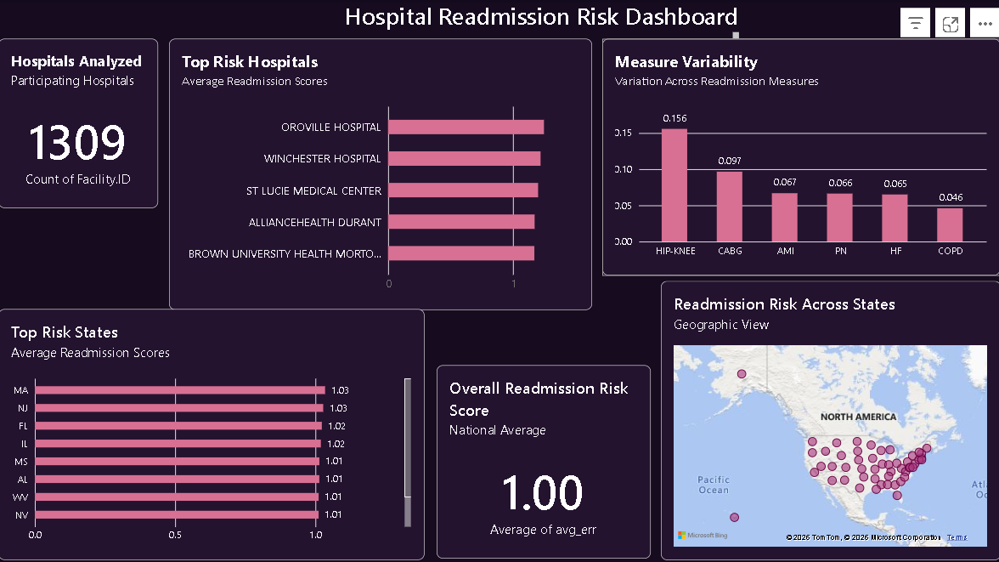

## Hospital Readmission Risk Dashboard
# Project Overview

This project explores hospital readmission risk across U.S. hospitals and states using Power BI. The dashboard was developed to identify variation in readmission performance, highlight high-risk providers, and visualize geographic patterns.

# Dashboard Features
Top Risk Hospitals
Top Risk States
Measure Variability Analysis
Geographic Risk Distribution Map
Hospital Count KPI

# Key Findings
Readmission risk varied across hospitals and states.
Some hospitals consistently demonstrated higher average readmission risk scores.
Variation differed by readmission measure, with certain measures showing greater spread than others.
Geographic patterns suggest that readmission risk is not evenly distributed across the United States.

## Technical Skills Demonstrated
SQL
R (dplyr, ggplot2)
Power BI
Healthcare Data Analytics
Data Visualization
KPI Development
Exploratory Data Analysis (EDA)

## Dashboard Preview

